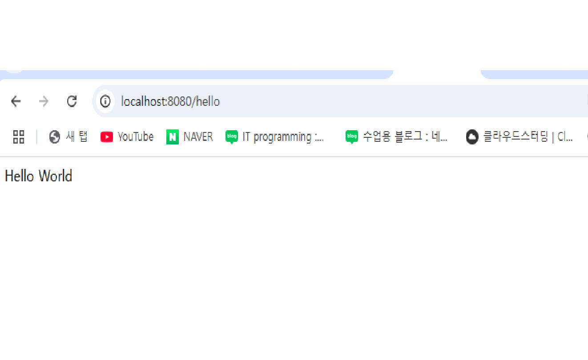
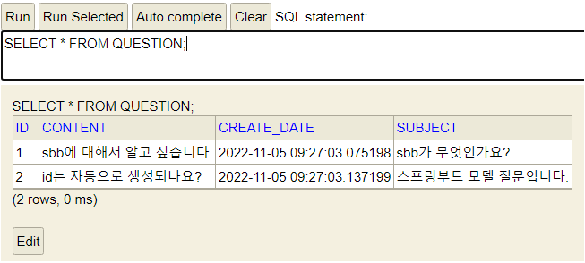
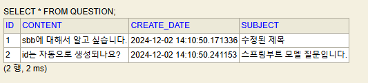

## Spring boot
> 1. 스프링부트란?
> 2. 프로젝트 생성
> 3. RequestMapping, ResponseBody
> 4. Test를 활용한 CRUD

---
### 스프링부트란?
- 자바의 웹 프레임워크로 기존 스프링 프레임워크에 톰캣 서버를 내장하고 여러 편의 기능들을 추가하여 꾸준한 인기를 누리고 있는 프레임 워크이다.
- 웹 프로그램을 쉽고 빠르게 만들어 주는 웹 프레임워크다.
  - 웹 프레임워크란?
  
    

    - 예를 들어 쿠키나 세션 처리, 로그인/ 로그아웃 처리, 권한 처리, 데이터베이스 처리 등 웹 프로그램을 위해 만들어야 할 기능이 전말 산더미처럼 많다.
    - 하지만 웹 프레임워크를 사용하면 이런 기능들을 일일이 만들 필요가 없다.
    - 웹 프레임워크에는 그런 기능들이 이미 만들어져 있기 때문이다.
    - 그저 웹 프레임워크에 있는 기능을 익혀서 사용하기만 하면 된다.
    - 웹 프레임워크는 웹ㅈ 프로그램을 만들기 위한 스타터 키트라고 생각하면 된다.
    - 자바로 만들어진 웹 프레임워크 중 하나가 스프링 부트이다.
- 스프링부트 설정
  - 스프링부트는 스프링의 복잡한 설정을 자동화 하고 단순화 하여 누구나 스프링을 쉽게 사용할 수 있게 만들었다.
---
### 프로젝트 생성
- New Project
  - Generators -> Spring Boot 선택
    - 첫 학습으로 Dependencies는 `Spring Web`, `Spring Boot DevTools`, `Lombok`, `H2 Database`, `Spring Data JPA`선택
      - Spring Web
        - 웹을 더 편리하고 빠르게 만들 수 있으며 다양한 기능과 도구를 제공하여 개발자의 부담을 덜어주는 도구
      - Spring Boot DevTools
        - 소스 변경이 발생할 때마다 빠르게 자동 빌드해줘서 바로바로 반영 결과를 확인할 수 있도록 도와주는 유용한 툴
        ```java
        - 설정
        Build, Exeution, Deployment > Compiler > Build project autiomaically 체크
        Advanced Settings > Allow auto-make to start even if developed application is currently running 체크
        ```
      - Lombok
        - Settings 내 plugins lombok 설치(기본적으로 설치가 되어있으나 다시 확인)
        - 코드를 자동완성 해주는 라이브러리
        - Getter, Setter, Equlas, ToString, 생성자 등 코드를 자동완성 시킬수 있다.
      - Spring Data JPA
        - JPA를 사용하여 데이터베이스를 처리한다.
        - JPA는 자바 진영에서 ORM(Object-Relational Mapping)의 기술 표준으로 사용하는 인터페이스의 모음
        ```java
        //JPA LOG
        spring.jpa.show-sql=true    //콘솔창에 sql 보여주기

        //JPA
        spring.jpa.properties.hibernate.dialect=org.hibernate.dialect.H2Dialect
        spring.jpa.hibernate.ddl-auto=update    //테이블 자체 업데이트
        ```
      - H2 Database
        - 주로 개발용이나 소규모 프로젝트에서 사용되는 파일 기반의 경량 데이터베이스이다.
        - H2를 사용하여 빠르게 개발하고 실제 운영시스템은 좀 더 규모있는 DB를 사용하는 것이 일반적인 개발 패턴
        ```java
        application.properties
        spring.h2.console.enabled=true
        spring.h2.console.path=/h2-console    //url 주소
        spring.datasource.url=jdbc:h2:C:/java/local   //jdbc:h2: 뒤에 local.mv.db 파일 있는 경로 작성
        spring.datasource.driverClassName=org.h2.Driver
        spring.datasource.username=sa
        spring.datasource.password= //학습중이라 비밀번호 설정X
        ```
---

### RequestMapping, ResponseBody
- RequestMapping은 '특정한 경로의 요청을 지정'하기 위해 사용된다.
- 컨트롤러 클래스의 선언부에도 사용할 수 있고, 컨트롤러의 메소드에도 사용할 수 있다.
- @Controller 어노테이션 사용이 필수!!!
- ResponseBody은 단순 메서드의 응답 결과가 문자열 그 자체임을 나타낸다.
```java
    @RequestMapping("/hello")   //localhost8080/hello
    @ResponseBody   // 기본 MVC는 컨트롤러가 화면을 전달하는데 여기서는 바로 표시
    public String hello() {
        return "Hello World";
    }
```
  

---

### Test를 활용한 CRUD
- DB테이블에 대응하는 클래스 생성
  ```java
  @Getter
  @Setter
  @Entity
  public class Question {
      @Id
      @GeneratedValue(strategy = GenerationType.IDENTITY)
      private Integer id;
  
      @Column(length = 200)
      private String subject;
  
      @Column(columnDefinition = "TEXT")
      private String content;
  
      private LocalDateTime createDate;
  }
  
  ```
  - 엔티티로 만들기 위해 @Entity 어노테이션 적용을 해야 JPA가 엔티티로 인식
  - @ID는 고유 속성을 기본 키로 지정하는 것이다.(primary eky)
  - @GeneratedValue는 속성의 값을 따로 세팅하지 않아도 1씩 자동으로 증가하여 저장
  - strategy는 고유번호를 생성하는 옵션으로 GenerationType.IDENTITY는 해당 컬럼만의 독립적인 시퀀스를 생성하여 번호를 증가시킬 때 사용
  - @Column은 세부 설정을 위해 사용 (length = 컬럼의 길이를 설정할때 사용, columnDefinition = "TEXT" 글자수를 제한 할수 없는 경우)

- Spring Boot에서 기본적으로 제공하는 `test` 파일에서 작업
- 데이터 처리를 위해서는 실제 데이터베이스와 연동하는 JPA 리포지터리가 필요하다.
  ```java
  public interface QuestionRepository extends JpaRepository<Question, Integer> {
  
      // 질문
      Question findBySubject(String subject);
      Question findBySubjectAndContent(String subject, String content);
      List<Question> findBySubjectContaining(String subject);
  
  }
  ```
- JpaRepository를 상속할 때는 제네릭 타입으로 <Question, Integer> 처럼 리포지터리의 대상이 되는 엔티티의 타입(Question)과 해당 엔티티의 PK의 속성 타입(Integer)을 지정해야 한다.
  - Question 엔티티의 PK(Primary Key) 속성인 id의 타입은 Integer 이다.
```java
@SpringBootTest
class SbbApplicationTests {

  @Autowired
  private QuestionRepository qRepo;

  @Test
  void testJpa() {
    Question q1 = new Question();
    q1.setSubject("sbb가 무엇인가요?");
    q1.setContent("sbb에 대해서 알고 싶습니다.");
    q1.setCreateDate(LocalDateTime.now());
    this.qRepo.save(q1); // 첫번째 질문 저장

    Question q2 = new Question();
    q2.setSubject("스프링부트 모델 질문입니다.");
    q2.setContent("id는 자동으로 생성되나요?");
    q2.setCreateDate(LocalDateTime.now());
    this.qRepo.save(q2);  // 두번째 질문 저장       
  }
}
```
  - @Autowired 어노테이션은 스프링의 DI 기능으로 questionRepository 객체를 스프링이 자동으로 생성해 준다.
  - 데이터 저장
    - q1,q2라는 Question 엔티티 객체를 생성하고 QuestionRepository를 이용하여 값을 데이텁제이스에 저장하는 코드
    
    - id는 Question 엔티티 기본키로 데이터를 생성할때 자동으로 1씩 증가 하는 것을 확인 가능
  - 데이터 조회
    ```java
    @Test
    void testFind() {
        List<Question> qList = this.qRepo.findAll();
        for (Question question : qList) {
            System.out.println(question.getSubject());
        }
        
        //하나만 찾아올때(id로 질문 찾기 : 이때 메소드는 Optional<제네릭>으로 리턴됨(못찾을 경우도 포함))
        Optional<Question> q1 = qRepo.findById(1);
        if(q1.isPresent()) {    //q1객체가 있을경우
            Question q = q1.get();  //get() 메소드로 가져옴
            System.out.println(q.getSubject());
        }
    }

    @Test
    void testFindBy() { // 해당 질문의 제목에 대한 답변 찾는법
        Question q = this.qRepo.findBySubject("sbb가 무엇인가요?");
        System.out.println(q.getContent());
    }

    @Test
    void testFindByContaining() {
        List<Question> qList = this.qRepo.findBySubjectContaining("sbb");
        for (Question q : qList) {
            System.out.println(q.getSubject());
        }
    }
    ```
    - findAll은 모든 데이터를 조회할때 사용되는 메서드
      - 총2건의 데이터가 있으므로 List<Question> 으로 Question 안의 데이터만 출력
    - findById(id값)은 매개변수에 해당 id값을 입력함으로써 id값으로 데이터 조회가 가능하다
      - 하지만 리턴 타입은 Optional로 사용
      - null 처리를 유연하게 처리하기 위해 사용하는 클래스로 isPresent로 null이 아닌지를 확인가능
    - findBySubject는 subject값으로 데이터를 조회가능 하다
      - Question 리포지토리는 기본적인 메서드는 제공이 되나, findBySubject는 제공 안되므로 인터페이스에 추가를 해야한다.
      - 그럼 해당 제목을 매겨변수에 입력하므로 제목으로 테이블 데이터를 조회할수 있다.
    - testFindByContaining은 Like와 동일 
      - 제목에 특정 문자열이 포함되어 있는 데이터를 조회가능
  
  - 데이터 수정
  ```java
@Test
    void testUpdate() {
        Optional<Question> oq = qRepo.findById(1);
        Question q = oq.get();
        q.setSubject("수정된 제목");
        this.qRepo.save(q); //입력과 수정은 같은 save 메소드 사용, 이때 id가 있으면 수정
    }
```
  - 해당 id값의의 이름을 찾아 제목을 변경
  - update도 저장과 동일하게 save() 메서드를 사용
  

- 데이터 삭제
 ```java
  @Test
void testDelete() {
  this.qRepo.deleteById(1);
}
 ```
  - 해당 아이디 값을 매겨변수에 작성하여 삭제

   

