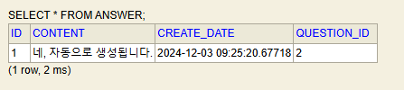
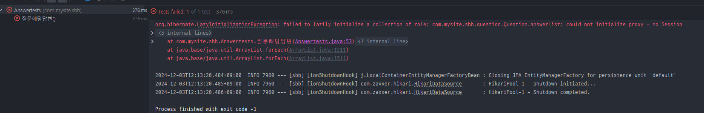
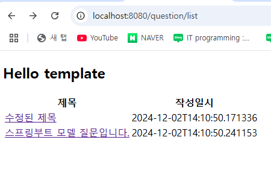
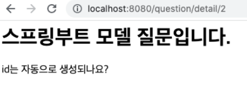

## Spring boot
> 1. Answer 데이터 생성, 저장, 검색
> 2. 질문 목록과 템플릿
> 3. 서비스
> 4. 질문상세
---

### Answer 데이터 생성, 저장, 검색
- 답변 데이터를 생성하고 저장
    ```java
     @Autowired
    private QuestionRepository qRepo;
    
    @Autowired
    private AnswerRepository aRepo;
    
    @Test
    public void input() {
        // 질문을 가져와서 그 질문에 해당 답변을 저장
        Optional<Question> oq = this.qRepo.findById(2); //id값이 2번
        Question q = oq.get();  //2번 질문 객체
        Answer a = new Answer();
        a.setQuestion(q);   //2번 질문에 답변
        a.setContent("네, 자동으로 생성됩니다.");
        a.setCreateDate(LocalDateTime.now());
        aRepo.save(a);
    }
    ```
    
    
    - 답변 데이터 처리를 위해 답변 리포지터리가 필요하므로 `AnswerRepository` 객체를 `@AutoWired`로 주입
    - id가 2인 질문 데이터를 가져온 다음 Answer 엔티티의 `question` 속성에 가져온 질문 데이터를 대입해 `a.setQuestion(q)` 데이터 생성
    - `Answer`엔티티에는 어떤 질문에 해당하는 답변인지 연결할 목적으로 `question` 속성이 필요
- 조회
  ```java
  @Test
      public void 조회() {
          Optional<Answer> oa = this.aRepo.findById(1);
          Answer a = oa.get();
          System.out.println(a.getContent());
      }
  ```

  - id값이 1번인 응답을 찾아오기

  - 질문에 대한 답변 조회
    - 질문의 답은 하나만 저장 하였으므로 추가적으로 id가 2번인 값에 하나 더 작성
    ```java
    @Test
        public void input() {
            // 질문을 가져와서 그 질문에 해당 답변을 저장
            Optional<Question> oq = this.qRepo.findById(2); //id값이 2번
            Question q = oq.get();  //2번 질문 객체
            Answer a = new Answer();
            a.setQuestion(q);   //2번 질문에 답변
            a.setContent("잘 모르겠습니다.");  //2번 질문에 추가적으로 작성
            a.setCreateDate(LocalDateTime.now());
            aRepo.save(a);
        }
    ```
    
    - 해당 메소드 
    ```java
    @Test
    public void 질문해당답변() {
        Optional<Question> oq = this.qRepo.findById(2);
        Question q = oq.get();

        List<Answer> aList = q.getAnswerList();
        for (Answer answer : aList) {
            System.out.println(answer.getContent());

        }
    }
    ```
      
    - id가 2인 질문에 답변을 한 개 등록했으므로 위와 같이 검증할 수 있다.
    - 하지만 위 코드를 실행시 에러 발생
    

    - `Question` 리포지터리가 `findById`를 호출하여 객체를 조회하고 나면  DB세션이 끊어지기 때문이다.
    - 이후 실행되는 `q.getAnserList()` 메서드는 세션이 종료되어 오류가 발생
    - `@Transaactional` 어노테이션을 사용하여 메서드가 종료될 때 까지 DB세션이 유지

---
### 질문 목록과 템플릿
```java
@Controller
public class QuestionController {

    @RequestMapping("/question/list")
    public String list() {
        return "question_list";
    }
}
```
  - 해당 컨트롤러 실행 시 오류 발생
  - 화면 뷰에 생성된 html이 존재하지 않고, `@ResponseBody`로 문자열을 직접 자바 코드로 작성하여 브라우저에 리턴시키지 못하기때문
- 템플릿 방식 활용
  - 자바 코드를 삽입할 수 있는 HTML 파일 생성
  - `dependencies`에 `Thymeleaf`추가
  - `Model` 클래스를 사용하여 템플릿에 전달
  ```java
  @RequestMapping("/list")
      public String list(Model model) {
  
          List<Question> qList = qService.getList();
          model.addAttribute("qList", qList);
          return "question_list";
      }
  ```
  
  - `Thymeleaf`를 사용하기 위해선 `<html xmlns:th="http://www.thymeleaf.org">` 작성
  ```java
  <!DOCTYPE html>
  <html xmlns:th="http://www.thymeleaf.org">
    <head>
      <meta charset="UTF-8" />
      <meta http-equiv="X-UA-Compatible" content="IE=edge" />
      <meta name="viewport" content="width=device-width, initial-scale=1.0" />
      <title>Document</title>
    </head>
    <body>
      <h2>Hello template</h2>
      <table>
        <thead>
          <tr>
            <th>제목</th>
            <th>작성일시</th>
          </tr>
        </thead>
        <tbody>
          <tr th:each="question : ${qList}">
            <td th:text="${question.subject}"></td>
            <td th:text="${question.createDate}"></td>
          </tr>
        </tbody>
      </table>
    </body>
  </html>
  ```
  
  - 타임리프
    1. 분기문 속성
       1. 분기문 속성은 다음과 같이 사용한다.
       2. th:if="${question != null}"
       3. 위의 경우 question 객체가 null 이 아닌 경우에 해당 엘리먼트가 표시된다.
    2. 반복문 속성
       1. 반복문은 반복횟수만큼 해당 엘리먼트를 반복하여 포시한다.
       2. 반복문 속성은 자바의 for each 문과 유사하다
       3. th:each="question : ${questionList}"
    3. 텍스트 속성
       1. th:text=값 속성은 해당 엘리먼트의 텍스트로 "값"을 출력한다.
       2. th:text="${question.subject}"
       3. 텍스트는 th:text 속성 대신에 다음처럼 대괄호를 사용하여 값을 직접 출력할수 있다.
       4. ```java
          <tr th:each="question : ${questionList}"> 
          <td>[[${question.subject}]]</td> 
          <td>[[${question.createDate}]]</td>
          </tr>
          ```
          
--- 
### 서비스
- 필요 이유
  - 모듈화
    - 예를들어 어떤 컨트롤러가 여러개의 리포지터리를 사용하여 데이터를 조회한후 가공하여 리턴한다고 가정해 보자. 이러한 기능을 서비스로 만들어 두면 컨트롤러에서는 해당 서비스를 호출하여 사용하면 된다. 하지만 서비스로 만들지 않고 컨트롤러에서 구현하려 한다면 해당 기능을 필요로 하는 모든 컨트롤러가 동일한 기능을 중복으로 구현해야 한다. 이러한 이유로 서비스는 모듈화를 위해서 필요하다.
  - 보안
    - 컨트롤러는 리포지터리 없이 서비스를 통해서만 데이터베이스에 접근하도록 구현하는 것이 보안상 안전하다. 이렇게 하면 어떤 해커가 해킹을 통해 컨트롤러를 제어할 수 있게 되더라도 리포지터리에 직접 접근할 수는 없게 된다.
- QuestionService
  ```java
  @Service
  public class QuestionService {
  
      @Autowired
      private QuestionRepository qRepo;
      
      public List<Question> getList(){
          return this.qRepo.findAll();
      }
  }
  ```
  
  - 서비스를 만들기 위해선 `@Service`어노테이션을 작성
  - 컨트롤러 페이지에 해당 메소드를 활용
```java
컨트롤러 : 서비스객체 주입해서 `getList()` 메소드 호출
서비스 : 레포지토리 주입해서 `findAll()` 메소드 호출
레포지토리 : JPA 하이버네이트에서 자동으로 구현된 `findAll()` 메소드로 DB에서 질문 데이터를 가져옴
```


---

### 질문상세
- 질문 목록의 제목을 클릭했을 때 화면이 호출되도록 링크 추가
    ```java
     <tr th:each="question, index : ${qList}">
              <td>
                <a th:href="@{/question/detail/__${question.id}__}" th:text="${question.subject}"></a>
              </td>
              <td th:text="${question.createDate}"></td>
            </tr>
    ```
    
    - "@{}"안에 변수를 넣으려면 변수 앞뒤에 __${변수}__를 작성한다.
    - Controller
    ```java
    @RequestMapping("/detail/{id}")
    public String detail(@PathVariable int id, Model model) {
        Question q = qService.getQuestion(id);
        model.addAttribute("q", q);
        return "question_detail";
    }
    ```
  
    - 해당 화면에 실제 제목과 내용을 출력 하기 위해 Service 추가
    ```java
    public Question getQuestion(Integer id) {  
            Optional<Question> question = this.qRepo.findById(id);
            if (question.isPresent()) {
                return question.get();
            } else {
                throw new DataNotFoundException("question not found");
            }
        }
    ```
  
    - 템플릿 화면
    ```java
    <h1 th:text="${question.subject}"></h1>
    <div th:text="${question.content}"></div>
    ```
  
    