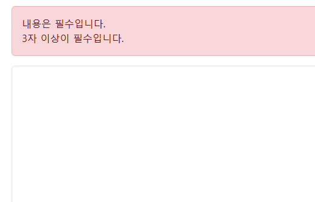
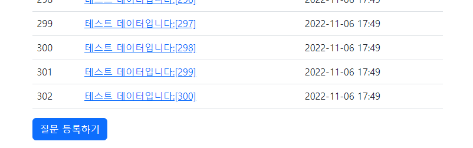
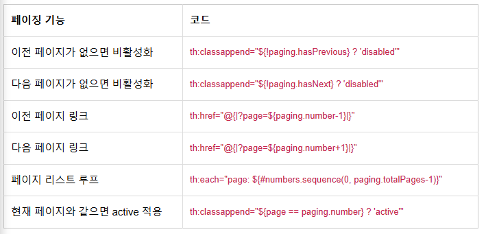
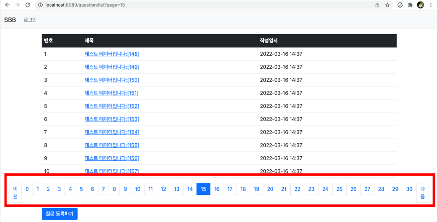
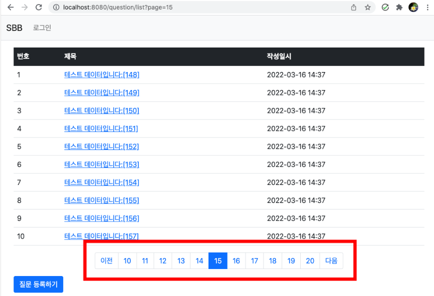
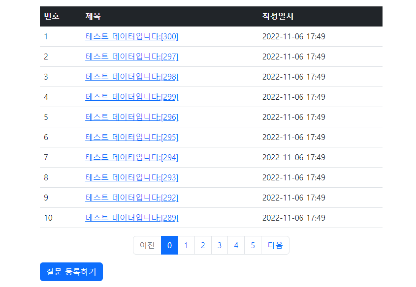
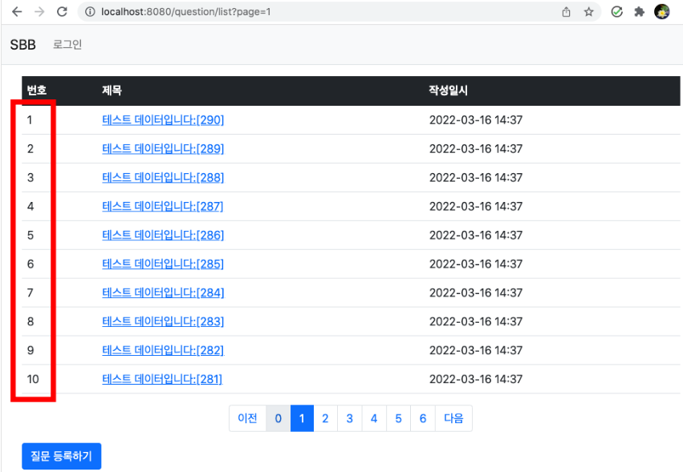
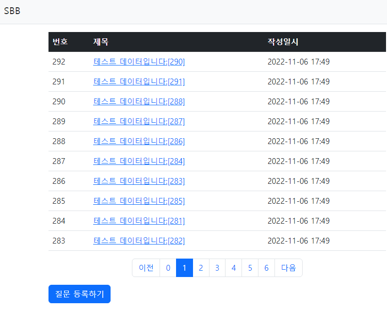

## Spring boot
> 1. 답변등록
> 2. 페이징
> 3. 게시물 일련번호 추가

---
### 답변등록
- 입력이 되자 않으면 답을 할수 없도록 답변폼을 생성
```java
@Getter
@Setter
public class AnswerForm {

	@NotBlank(message = "내용은 필수항목입니다.")
	private String content;
}
```

- 답변 등록을 위한 Controller 작성
```java
	@PostMapping("/create/{id}")
	public String createAnswer(Model model, @PathVariable("id") Integer id,
							@Valid AnswerForm answerForm, BindingResult result) {
		Question question = this.qService.getQuestion(id);
		if(result.hasErrors()) {
			model.addAttribute("question", question);
			return "question_detail";
		}
		this.aService.create(question, answerForm.getContent());
		return String.format("redirect:/question/detail/%s", id);
	}
```
- `@Valid`와 `BindingResult`를 활용하여 검증을 진행
  - 만약 `result`가 에러 메시지를 가지고 있으면 해당 페이지에 오류 메시지 출력
    
---
### 페이징
- 더미 데이터 생성
  ```java
  @SpringBootTest
  class SbbApplicationTests {
  
      @Autowired
      private QuestionService questionService;
  
      @Test
      void testJpa() {
          for (int i = 1; i <= 300; i++) {
              String subject = String.format("테스트 데이터입니다:[%03d]", i);
              String content = "내용무";
              this.questionService.create(subject, content);
          }
      }
  }
  ```
  

  - 문제점으로 해당 한 페이지에 모든 데이터가 보여져 페이징이 필수

- 페이징 구현
  - JPA 환경 구축시 설치했던 라이브러리에 페이징 패키지가 들어있으므로 리포지터리에 추가
  ```java
  org.springframework.data.domain.Page
  
  org.springframework.data.domain.PageRequest
  
  org.springframework.data.domain.Pageable
  
  public interface QuestionRepository extends JpaRepository<Question, Integer> {

    Page<Question> findAll(Pageable pageable);
  }
  ```
  
- 서비스 수정
  - 기존에 있던 출력 getList() 메서드를 Page에 맞게 수정
  ```java
  public Page<Question> getList(int page){
          Pageable pageable = PageRequest.of(page, 10);
          return this.qRepo.findAll(pageable);
  }
  ```
  
  - 정수 타입의 페이지번호를 입력받아 해당 페이지의 질문 목록을 리턴하는 메서드로 변경
  - page는 조회할 페이지의 번호이며, 10은 한 페이지에 보여줄 게시물의 개수를 의미
  - 이후 Controller 수정
  ```java
  @RequestMapping("/list")
  public String list(Model model, @RequestParam(value = "page", defaultValue = "0") int page) {
      Page<Question> paging = this.qService.getList(page);
      model.addAttribute("paging", paging);
      return "question_list";
  }
  ```
  
  - 스프링부트의 페이징 첫페이지 번호는 1이 아닌 0이다.

- 템플릿에 페이지 이동 기능 구현
  ```java
  <!-- 페이징처리 시작 -->
      <div th:if="${!paging.isEmpty()}">
          <ul class="pagination justify-content-center">
              <li class="page-item" th:classappend="${!paging.hasPrevious} ? 'disabled'">
                  <a class="page-link"
                      th:href="@{|?page=${paging.number-1}|}">
                      <span>이전</span>
                  </a>
              </li>
              <li th:each="page: ${#numbers.sequence(0, paging.totalPages-1)}"
                  th:classappend="${page == paging.number} ? 'active'" 
                  class="page-item">
                  <a th:text="${page}" class="page-link" th:href="@{|?page=${page}|}"></a>
              </li>
              <li class="page-item" th:classappend="${!paging.hasNext} ? 'disabled'">
                  <a class="page-link" th:href="@{|?page=${paging.number+1}|}">
                      <span>다음</span>
                  </a>
              </li>
          </ul>
      </div>
  ```
  - `disabled`은 이전 이후 페이지가 없을 경우 비활성화
  - 페이지 리스트는 루프를 돌며 해당 페이지로 이동할 수 있는 링크를 생성
  - 이때 루프 도중의 페이지가 현재 페이지와 같을 경우에는 active 클래스를 적용하여 강조표시
  - 템플릿 수요 기능
    
  
  - `#numbers.sequence(0,paging.totalPages-1)은 시작 번호부터 끝 번호까지의 루프를 만들어 내는 타임리프 유틸리티
    
  
  - 페이징 처리는 되었지만 한 페이지에 모두 표시가 되는 문제가 발생
  ```java
   <li th:each="page: ${#numbers.sequence(0, paging.totalPages-1)}"
                th:if="${page >= paging.number-5 and page <= paging.number+5}"
                th:classappend="${page == paging.number} ? 'active'" class="page-item">
  ```
  - 현재 페이지 기준으로 좌우 5씩 보이도록 생성
    

- 작성일시 역순으로 조회
  - 게시판은 최근 작성한 게시물이 가장 먼저 보이므로 작성했던 서비스 수정
  ```java
  public Page<Question> getList(int page){
          Pageable pageable = PageRequest.of(page, 10, Sort.by("createDate").descending());
          return this.qRepo.findAll(pageable);
      }
  ```
  - PageRequest.of 메서드의 세번째 파라미터로 Sort.by("createDate").descending() 작성시 최근 등록된 순으로 연순환
    

---
- 게시물 일련번호 추가
  - 게시물 번호는 페이지가 될때마다 1부터 시작되는 문제
    

  - 질문 게시물의 번호를 역순으로 정렬을 위해선 공식을 적용
    - 번호 = 전체 게시물 개수 - (현재 페이지 * 페이지당 게시물 개수) - 나열 인덱스
- 템플릿에 적용
  - question_list.html에 작성
  ```java
  <td th:text="${paging.getTotalElements - (paging.number * paging.size) - loop.index}"></td>
  ```
  
  