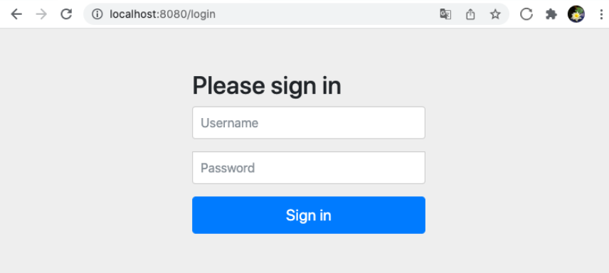
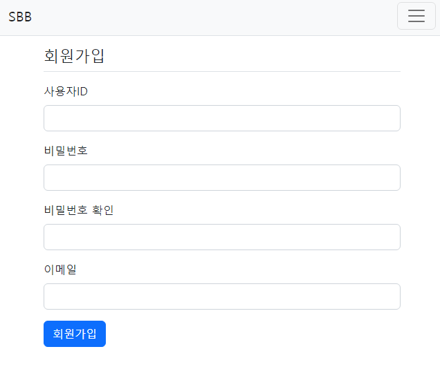
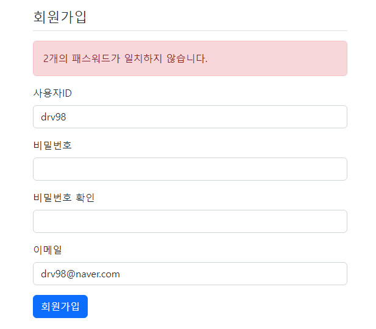
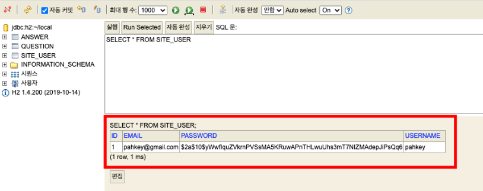
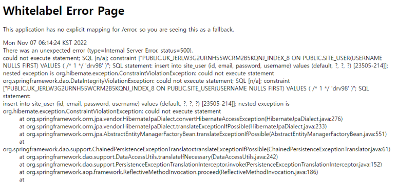
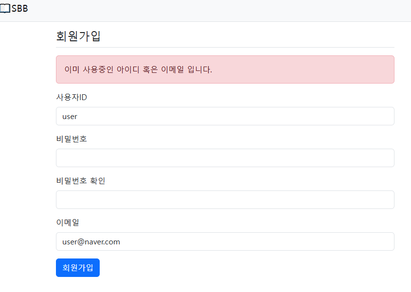

## Spring boot
> 1. 스프링 시큐리티
> 2. 회원가입
---
###스프링 시큐리티
- 스프링 기반 애플리케이션의 인증과 구너한을 담당하는 스프링의 하위 프레임워크
- 인증(Authenticate)은 로그인을 의미한다.
- 권한(Authorize)은 인증된 사용자가 어떤 것을 할 수 있는지를 의미한다. 
- 스프링 시큐리티 디펜던시 라이브러리 설치
  - pom.xml > dependencies에 `Spring Security` 추가
- 설치 이후에 화면에 접속하면 로그인 화면이 구현

  
  - 기본적으로 인증되지 않은 사용자는 서비스를 사용할수 없게 된다.
-시큐리티 설정
  - 로그인없이 조회할 수 있도록 SecurityConfig.java 파일 작성
  ```java
  @Configuration
  @EnableWebSecurity
  public class SecurityConfig {
  
      @Bean
      SecurityFilterChain filterChain(HttpSecurity http) throws Exception {
          http
                  .authorizeHttpRequests(
                          authorizeRequests -> authorizeRequests
                                  .requestMatchers(new AntPathRequestMatcher("/**")).permitAll())
                  .csrf((csrf) -> csrf
                          .ignoringRequestMatchers(new AntPathRequestMatcher("/h2-console/**")))
                  .headers((headers) -> headers
                          .addHeaderWriter(new XFrameOptionsHeaderWriter(
                                  XFrameOptionsHeaderWriter.XFrameOptionsMode.SAMEORIGIN)))
          ;
          return http.build();
      }
  }
  ```
  - `@Configuration`은 스프링의 환결설정 파일임을 의미하는 어너테이션
  - `@EnableWebSecurity` 모든 요청 URL이 스프링 시큐리티의 제어를 받오록 만드는 어노테이션
  - 시큐리티 세부 설정은 `SecurityFilterChain`빈을 생성하여 설정
  - ("/**")).permitAll()은 모든 인증되지 않은 요청을 허락한다는 의미
  - 로그인을 하지 않아도 모든 페이지에 접근
  - H2 콘솔 로그인시도 403 Forbidden 오류 발생
  - 스프링 시큐리티를 적용하면 CSRF 기능이 동작
  ```java
  CSRF란?
  
  CSRF(cross site request forgery)는 웹 사이트 취약점 공격을 방지를 위해 사용하는 기술이다. 스프링 시큐리티가 CSRF 토큰 값을 세션을 통해 발행하고 웹 페이지에서는 폼 전송시에 해당 토큰을 함께 전송하여 실제 웹 페이지에서 작성된 데이터가 전달되는지를 검증하는 기술이다.
  ```
  - CSRF 토큰이 자동으로 생성
  - 토큰의 값이 정확한지 검증하는 과정을 거친다.
  - H2 콘솔은 CSRF 토큰을 발행하는 기능이 없어 403 발생
  - URL 요청 시 XFrameOptions 헤더값을 sameorigin으로 설정하여 오류가 발생하지 않도록 막음

---
### 회원가입
- 엔티티 생성
  ```java
  @Getter
  @Setter
  @Entity
  public class SiteUser {
  
      @Id   //PK값
      @GeneratedValue(strategy = GenerationType.IDENTITY)   //시퀀스 1씩 증가
      private Long id;
  
      @Column(unique = true)    //중복 처리 방지
      private String username;
  
      private String password;
  
      @Column(unique = true)    // 중복 처리 방지
      private String email;
  }
  ```
  
- 리포지토리 및 서비스
  - 리포지토리
  ```java
  public interface UserRepository extends JpaRepository<SiteUser, Long> {
  }
  ```
  - 서비스
  ```java
  @Service
  public class UserService {
      
      @Autowired
      private UserRepository userRepo;
      
      public SiteUser create(String username, String email, String password) {
          SiteUser user = new SiteUser();
          user.setUsername(username);
          user.setEmail(email);
          //비밀번호 암호화 객체 (빈으로 등록하여 주입)
          BCryptPasswordEncoder passwordEncoder = new BCryptPasswordEncoder();
          user.setPassword(passwordEncoder.encode(password));
          this.userRepo.save(user);
          return user;
      }
  
  }
  ```
  - 데이터베이스에 보안을 위해 패스워드는 암호화로 저장해야하는 것이 필수
  - 시큐리티 BCryptPasswordEncoder 클래스를 사용하여 암호화
- 회원가입 폼
  ```java
  @Getter
  @Setter
  public class UserCreateForm {
      @Size(min = 3, max = 25)  //최소3글자 이상 25글자 이하
      @NotEmpty(message = "사용자ID는 필수항목입니다.")    //작성안할시 메시지 발생
      private String username;
  
      @NotEmpty(message = "비밀번호는 필수항목입니다.")
      private String password1;
  
      @NotEmpty(message = "비밀번호 확인은 필수항목입니다.")
      private String password2;
  
      @NotEmpty(message = "이메일은 필수항목입니다.")
      @Email
      private String email;
  }
  ```
- 컨트롤러
  ```java
  @Controller
  @RequestMapping("/user")
  public class UserController {
  
    @Autowired
    private UserService userService;
  
    @GetMapping("/signup")
    public String signup(UserCreateForm userCreateForm) {
      return "signup_form";
    }
  
    @PostMapping("/signup")
    public String signup(@Valid UserCreateForm userCreateForm, BindingResult bindingResult) {
      if(bindingResult.hasErrors()) { //실패 했을경우 현재 페이지 유지
        return "signup_form";
      }
      if(!userCreateForm.getPassword1().equals(userCreateForm.getPassword2())) {  //패스워드1과 패스워드 2가 동일하지 않으면
        bindingResult.rejectValue("password2", "passwordInCorrect","패스워드가 일치하지 않습니다.");
        return "signup_form";
      }
      try{
        userService.create(userCreateForm.getUsername(),userCreateForm.getEmail(),userCreateForm.getPassword1());
      } catch (DataIntegrityViolationException e) {
        e.printStackTrace();
        bindingResult.reject("signupFailed","이미 사용중인 아이디 혹은 이메일 입니다.");
        return "signup_form";
      } catch (Exception e){
        e.printStackTrace();
        bindingResult.reject(e.getMessage());
        return "signup_form";
      }
      return "redirect:/";
    }
  }
  ```
  - URL이 GET으로 요청되면 회원가입을 위한 템플릿을 렌더링하고 POST로 요청되면 회원가입을 짆애
  - 비밀번호1, 비밀번호2가 동일한지를 검증하는 로직 추가
  - 일치하지 않을 경우 `bindingResult.rejectValue`를 사용하여 오류가 발생
  - 각 파라미터로는 (필드명, 오류코드, 에러메시지)를 의미
- 회원가입 템플릿
  ```java
  <!DOCTYPE html>
  <html xmlns:th="http://www.thymeleaf.org">
  <html lang="en">
  <head th:replace="layout::head"></head>
  <body>
  <nav th:replace="layout::nav"></nav>
  <div class="container my-3">
      <div class="my-3 border-bottom">
          <div>
              <h4>회원가입</h4>
          </div>
      </div>
      <form th:action="@{/user/signup}" th:object="${userCreateForm}" method="post">
          <div th:replace="layout::formErrors"></div>
          <div class="mb-3">
              <label for="username" class="form-label">사용자ID</label>
              <input type="text" th:field="*{username}" class="form-control" />
          </div>
          <div class="mb-3">
              <label for="password1" class="form-label">비밀번호</label>
              <input type="password" th:field="*{password1}" class="form-control" />
          </div>
          <div class="mb-3">
              <label for="password2" class="form-label">비밀번호 확인</label>
              <input type="password" th:field="*{password2}" class="form-control" />
          </div>
          <div class="mb-3">
              <label for="email" class="form-label">이메일</label>
              <input type="email" th:field="*{email}" class="form-control" />
          </div>
          <button type="submit" class="btn btn-primary">회원가입</button>
      </form>
  </div>
  </body>
  </html>
  ```
  - id, password1, password2, email에 해당되는 input  추가
  - 회원가입 버튼을 클릭시 폼 데이터가 POST방식으로 `/user/signup/` URL로 전송
    
  
  - 입력값 중 비밀번호, 비밀번호 확인이 다르게 입력되면 검증 오류가 발생
    
  
  - 올바른 입력값으로 회원가입을 완료하면 메인 페이지로 리다이렉트
- 정보 확인
  

- 중복 회원가입
  - 가입된 동일한 id 혹은 email로 회원가입 진행시 오류 발생
    

  - Controller에서 try{}catch{}로 예외처리 발생 수정
  - DataIntegrityViolationException으로 오류 화면에 표시하도록 수정
  - 다른 오류가 발생시 해당 오류 메시지를 출력하도록 수정
    
