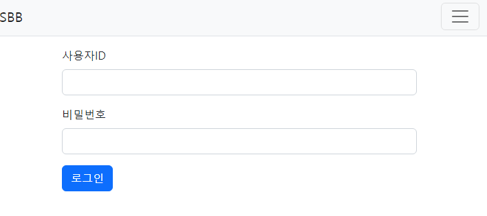
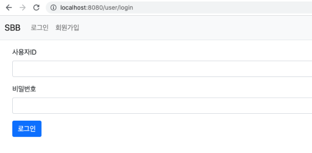
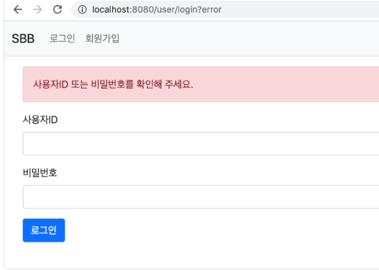
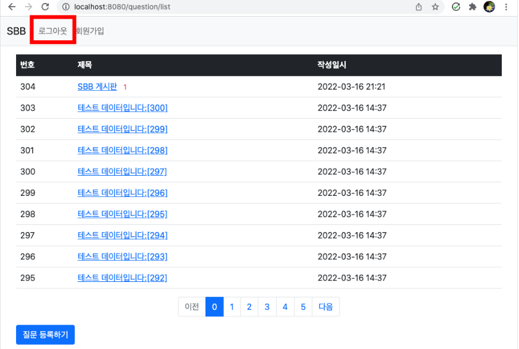
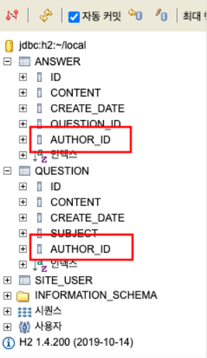
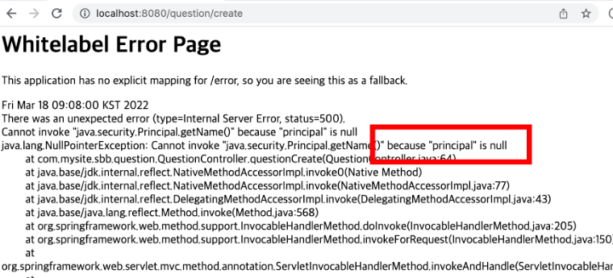
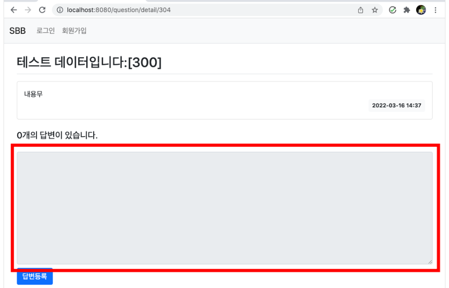
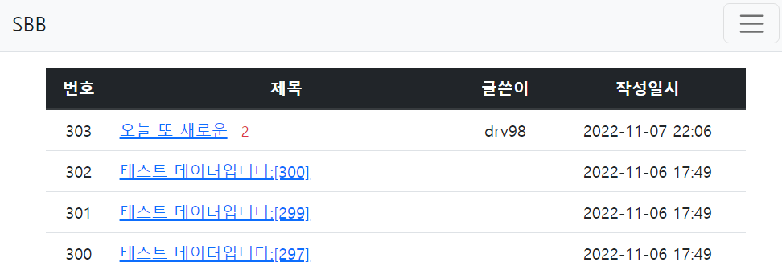
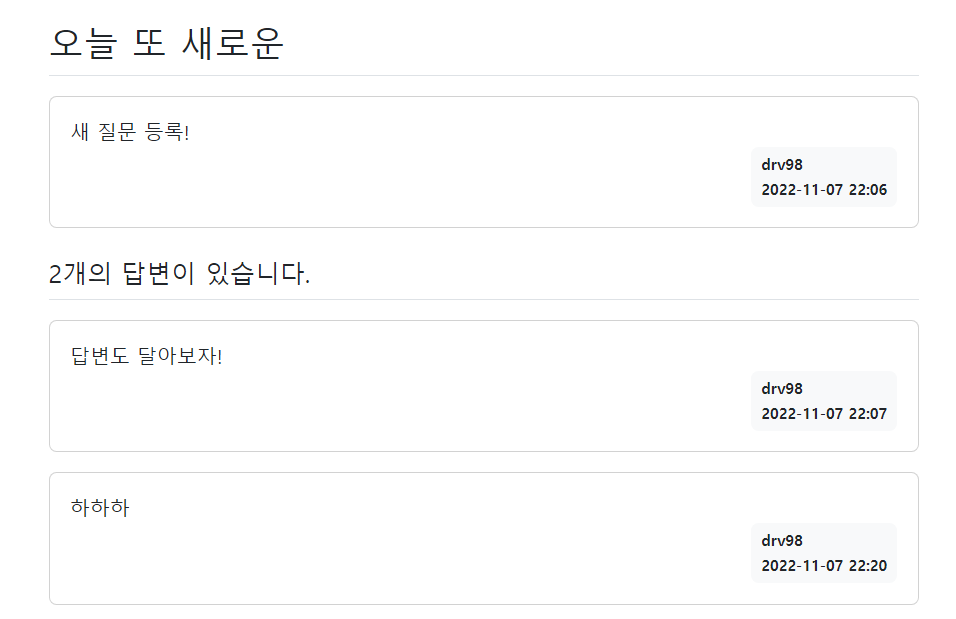

## Spring boot
> 1. 로그인
> 2. 로그아웃
> 3. 엔티티 변경 글쓴이 추가
> 4. 로그인 유저만 질문/ 답변 가능
> 5. 글쓴이 표시

---
### 로그인
- 게시판은 질문한 사람, 답변한 사람을 구별하는 로그인, 로그아웃 필수 기능
- SecurityConfig.java 수정
    ```java
    .formLogin((formLogin) -> formLogin
                            .loginPage("/user/login")
                            .defaultSuccessUrl("/"))
    ```
  - 로그인 페이지의  URL 주소를 `/user/login`으로 성공 시 디폴트 페이지는 `/`로 설정
- 컨트롤러 수정
    ```java
      @GetMapping("/login")
        public String login() {
            return "login_form";
        }
    ```
  - 랜더링 할수 있는 메서드 생성
- 템플릿 생성
    ```java
    <form th:action="@{/user/login}" method="post">
            <div th:if="${param.error}">
              <div class="alert alert-danger">사용자ID 또는 비밀번호를 확인해 주세요.</div>
            </div>
            <div class="mb-3">
              <label for="username" class="form-label">사용자ID</label>
              <input type="text" name="username" id="username" class="form-control" />
            </div>
            <div class="mb-3">
              <label for="password" class="form-label">비밀번호</label>
              <input type="password" name="password" id="password" class="form-control" />
            </div>
            <button type="submit" class="btn btn-primary">로그인</button>
          </form>
    ```
  - 로그인 실패시 로그인 페이지로 리다이렉트 된다.
  - error과 함께 전달
  - 로그인 실패시 파라미터로 error가 전달되는 것은 스프링 시큐리티의 규칙
    

- 화면은 출력이 되지만 무엇을 기준으로 로그인 할지에 대한 설정이 없다
- 데이터베이스에서 사용자를 조회하는 서비스를 만든다.
- UserRepository 추가
  ```java
  public interface UserRepository extends JpaRepository<SiteUser, Long> {
      Optional<SiteUser> findByusername(String username);
  }
  ```
  
- UserRole 추가
  - 시큐리티는 인증 뿐 아니라 권한도 관리
  - 인증 후 사용자에게 부여할 권한이 필요
  - ADMIN, USER 권한을 갖는 열거형 생성
  ```java
  @Getter
  public enum UserRole {
      ADMIN("ROLE_ADMIN"),
      USER("ROLE_USER");
  
      UserRole(String value) {
          this.value = value;
      }
  
      private String value;
  }
  ```
- 시큐리티 서비스 추가
  ```java
  @Service
  public class UserSecurityService implements UserDetailsService {
  
      @Autowired
      private UserRepository userRepo;
  
      @Override
      public UserDetails loadUserByUsername(String username) throws UsernameNotFoundException {
          Optional<SiteUser> _siteUser = this.userRepo.findByusername(username);
          if (_siteUser.isEmpty()) {
              throw new UsernameNotFoundException("사용자를 찾을수 없습니다.");
          }
          SiteUser siteUser = _siteUser.get();
          
          List<GrantedAuthority> authorities = new ArrayList<>();
          if ("admin".equals(username)) {
              authorities.add(new SimpleGrantedAuthority(UserRole.ADMIN.getValue()));
          } else {
              authorities.add(new SimpleGrantedAuthority(UserRole.USER.getValue()));
          }
          return new User(siteUser.getUsername(), siteUser.getPassword(), authorities);
      }
          
  }
  ```
  - `UserDetailsService`는 `loadUserBuUsername`메서드를 구현하도록 강제하는 인터페이스이다.
  - 사용자명으로 비밀번호를 조회하여 리턴하는 메시지
  - 사용자명으로 `SiteUser`객체를 조회하는 메서드
  - 사용자명이 `admin`인 경우 ADMIN 권한을 부여하고 그 외 경우는 USER 권한을 부여
- SecurityConfig 빈 추가
```java
  @Bean
      public AuthenticationManager authenticationManager(AuthenticationConfiguration authenticationConfiguration) throws Exception {
          return authenticationConfiguration.getAuthenticationManager();
      }
  ```
  - 스프링 시큐리티 인증을 담당
  - 생성시 **스프링의 내부 동작**으로 작성한 `**UserSecurityService**`,`**PasswordEncoder**`가 자동으로 설정
- navbar 수정
  ```java
   <li class="nav-item">
                      <a class="nav-link" th:href="@{/user/login}">로그인</a>
   </li>
  ```
  - 로그인 링크에 로그인 페이지로 이동하도록 추가
    

  - 데이터베이스에 없는 입력을 찾을시 오류 발생
    

---
### 로그아웃
- 이전 까지는 네비게이션 바는 로그인이란 버튼이 항상 남아있었다
- 사용자 로그인 여부에 따라 로그아웃으로 변경되도록 수정
  ```java
  <li class="nav-item">
                <a class="nav-link" sec:authorize="isAnonymous()" th:href="@{/user/login}">로그인</a>
                <a class="nav-link" sec:authorize="isAuthenticated()" th:href="@{/user/logout}">로그아웃</a>
              </li>
              <li class="nav-item">
                <a class="nav-link" th:href="@{/user/signup}">회원가입</a>
              </li>
  ```
  - sec:authorize="isAnonymous()" - 이 속성은 로그인 되지 않은 경우에만 해당 엘리먼트가 표시되게 한다.
  - sec:authorize="isAuthenticated()" - 이 속성은 로그인 된 경우에만 해당 엘리먼트가 표시되게 한다.
  - 따라서 다음과 같이 내비게이션바를 수정할수 있다.
    

- 로그아웃 구현
- SecurityConfig 수정
  ```java
  .logout((logout) -> logout
                  .logoutRequestMatcher(new AntPathRequestMatcher("/user/logout"))
                  .logoutSuccessUrl("/")
                  .invalidateHttpSession(true))
  ```
  - 로그아웃 URL을 `/user/logout`으로 설정하여 성공시 `/`페이지로 이동
  - 이후 로그아웃 시 생성된 세션도 삭제 처리

---
### 엔티티 변경 글쓴이 추가
- Question 클래스에 author(글쓴이) 속성 추가
  ```java
   @ManyToOne
      private SiteUser author;
  ```
  - 여러개의 질문이 한 명의 사용자에게 작성될수 있도록 `@ManyToOne`관계 성립
- Answer 클래스에 author(글쓴이) 속성 추가
  ```java
   @ManyToOne
      private SiteUser author;
  ```
- 테이블 확인
  

  - `site_user` 테이블의 id 값이 저장되어 SiteUser엔티티와 연결
- 답변 작성자 저장하기
  ```java
   @PostMapping("/create/{id}")
      public String createAnswer(Model model, @PathVariable("id") Integer id, 
              @Valid AnswerForm answerForm, BindingResult bindingResult, Principal principal) {
          (... 생략 ...)
      }
  ```
  - 로그인 정보를 알기 위해 시큐리티가 제공하는 `Principal`객체사용
  - `principal.getName()` 호출로 현재 로그인한 사용자의 ID를 알수있다.
- UserService 추가
  ```java
  public SiteUser getUser(String username) {
          Optional<SiteUser> siteUser = this.userRepo.findByUsername(username);
          if (siteUser.isPresent()) {
              return siteUser.get();
          } else {
              throw new DataNotFoundException("siteuser not found");
          }
      }
  ```
- AnswerService 수정
  ```java
      public void create(Question question, String content, SiteUser author) {
          Answer answer = new Answer();
          answer.setContent(content);
          answer.setCreateDate(LocalDateTime.now());
          answer.setQuestion(question);
          answer.setAuthor(author);
          this.aRepo.save(answer);
      }
  ```
  - Service 구현으로 Controller작성시 답변을 작성시 작성자도 함께 저장된다.
  ```java
  @Autowired
      private UserService uService;
      
      @PostMapping("/create/{id}")
      public String createAnswer(Model model, @PathVariable("id") Integer id,
                              @Valid AnswerForm answerForm, BindingResult result, Principal principal) {
          Question question = this.qService.getQuestion(id);
          SiteUser siteUser = this.uService.getUser(principal.getName()); //추가
          if(result.hasErrors()) {
              model.addAttribute("question", question);
              return "question_detail";
          }
          this.aService.create(question, answerForm.getContent(), siteUser); //수정
          return String.format("redirect:/question/detail/%s", id);
      }
  ```
  - 답변 저장메서드를 구현하였으므로, 질문에 대한 service 및 controller로 참고해서 만들어보자
---
### 로그인 유저만 질문/답변 가능
- 로그아웃 상태에서 질문, 답변 등록하면 500에러 발생


  - `principal` 객체가 `null`값이라서 발생
  - `principal` 객체는 로그인을 해야만 생성되는 객체이다.
  - 객체를 사용하기 위해선 `@PreAuthorize("isAuthenticated()")`을 사용해야한다.
  - 로그인이 필요한 메서드를 의미
  - 로그아웃 상태에서 호출되면 로그인 페이지로 이동된다.
- Controller 수정
  ```java
  @PreAuthorize("isAuthenticated()")
      @GetMapping("/create")
      public String questionCreate(QuestionForm questionForm) {
          return "question_form";
      }
  
      @PreAuthorize("isAuthenticated()")
    @PostMapping("/create")
    public String qCreate(@Valid QuestionForm questionForm,
                          BindingResult bindingResult,
                          Principal principal) {
        SiteUser siteUser = userService.getUser(principal.getName());

        //@Valid로 해당 객체를 검사한다. 결과는 두번째 나오는 바인딩리절트에 저장됨
        if(bindingResult.hasErrors()) {
            return "question_form"; //되돌아감
        }
        qService.createQuestion(questionForm.getSubject(), questionForm.getContent(), siteUser);
        return "redirect:/question/list";
    }
  ```
  ```java
      //답변글쓰기 인증되지 않은 상태이면 요청이 안되게 접근이 불가
      @PreAuthorize("isAuthenticated()")
      @PostMapping("/create/{id}")
      public String create(@PathVariable int id,
                           @Valid AnswerForm answerForm,
                           BindingResult bindingResult,
                           Model model,
                           Principal principal) {     //인증이 되면 User 정보가 Principal(username) 내 저장 되어 있다.
          // 질문을 가져온다.
          Question q = qService.getQuestion(id);
          // 답변을 저장하는 서비스
          SiteUser siteUser = uService.getUser(principal.getName());
          if(bindingResult.hasErrors()) {
              model.addAttribute("q", q);
              return "question_detail";
          }
          aService.create(q, answerForm.getContent(), siteUser);
          // 답변을 저장한 후 다시 상세화면으로 전환
          return "redirect:/question/detail/" + id;
      }
  
      @PreAuthorize("isAuthenticated()")
      @GetMapping("/modify/{id}")
      public String modifyAnswer(@PathVariable int id,
                                 Principal principal,
                                 AnswerForm answerForm) {
          Answer a = aService.getAnswer(id);
          if(!a.getAuthor().getUsername().equals(principal.getName())) {
              throw new ResponseStatusException(HttpStatus.BAD_REQUEST, "수정권한이 없습니다.");
          }
          answerForm.setContent(a.getContent());
          return "answer_form";
      }
  ```
- `@PreAuthorize` 어노테이션 동작을 위해 `SecurityConfig`수정
  ```java
  @EnableGlobalMethodSecurity(prePostEnabled = true)
  ```
  - 해당 설정은 질문, 답변 Controller에서 로그인 여부를 판별하기 위해 사용했던 `@PreAuthorize`를 사용하기 위해 반드시 필요

- disabled
  - 로그아웃 상태에서 글을 작성할수 없도록 작성란을 막는것이 효과적
  - detail.html 수정
  ```java
  <textarea sec:authorize="isAnonymous()" disabled th:field="*{content}" class="form-control" rows="10"></textarea>
          <textarea sec:authorize="isAuthenticated()" th:field="*{content}" class="form-control" rows="10"></textarea>
  ```
  - 로그아웃 상태일때 `disabled`속성을 적용해 입력이 안되도록 만들었다.
  - sec:authorize="isAnonymous()" - 현재 로그아웃 상태
  - sec:authorize="isAuthenticated()" - 현재 로그인 상태
    

---
### 글쓴이 표시
- 해당 상세 화면에 글쓴이 표시
- 리스트 페이지 수정
  ```java
  <tr class="text-center">
      <th>번호</th>
      <th style="width:50%">제목</th>
      <th>글쓴이</th>
      <th>작성일시</th>
  </tr>
  
  <tr class="text-center" th:each="question, loop : ${paging}">
      <td th:text="${paging.getTotalElements - (paging.number * paging.size) - loop.index}"></td>
      <td class="text-start">
          <a th:href="@{|/question/detail/${question.id}|}" th:text="${question.subject}"></a>
          <span class="text-danger small ms-2" th:if="${#lists.size(question.answerList) > 0}"
  th:text="${#lists.size(question.answerList)}">
          </span>
      </td>
      <td><span th:if="${question.author != null}" th:text="${question.author.username}"></span></td>
      <td th:text="${#temporals.format(question.createDate, 'yyyy-MM-dd HH:mm')}"></td>
  </tr>
  ```
  - 더미데이터로 작성한 내용에는 글쓴이가 표시되지 않지만 새롭게 질문을 만들면 글쓴이가 표시
    

- detail 페이지 수정
  ```java
   <div class="badge bg-light text-dark p-2 text-start">
                  <div class="mb-2">
                      <span th:if="${question.author != null}" th:text="${question.author.username}"></span>
                  </div>
                  <div th:text="${#temporals.format(question.createDate, 'yyyy-MM-dd HH:mm')}"></div>
              </div>
  ```
  