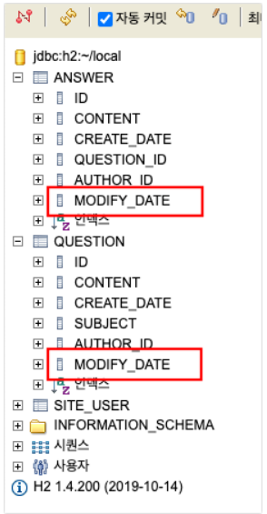
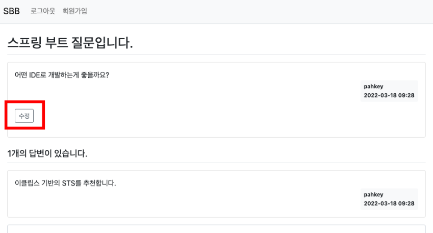
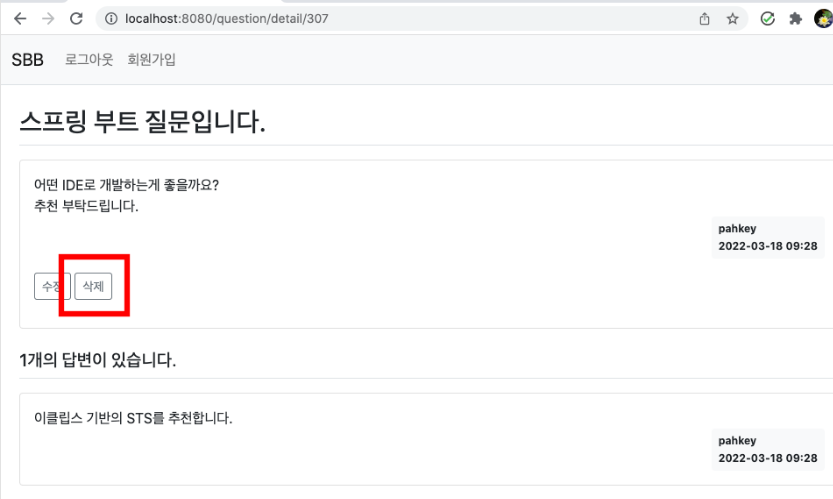
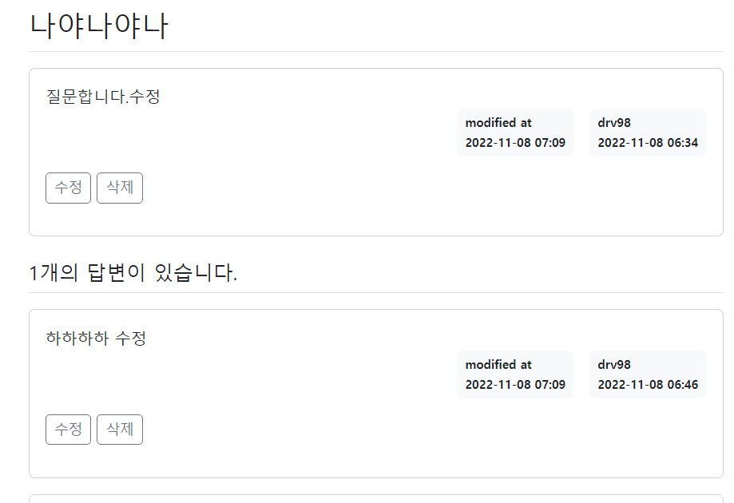
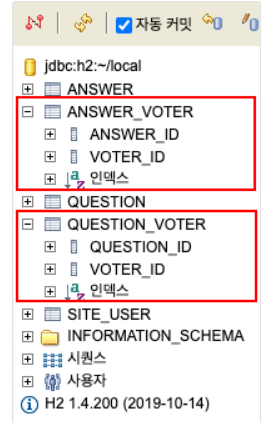
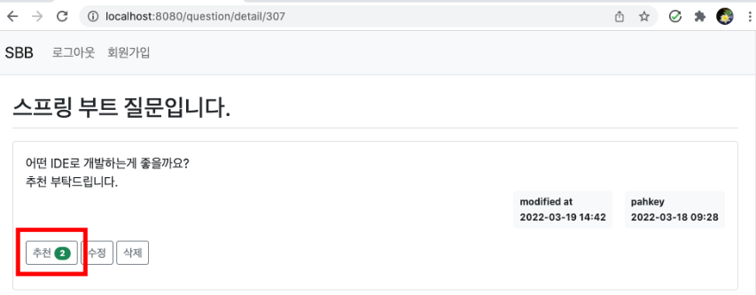

## Spring boot
> 1. 질문 수정
> 2. 질문 삭제
> 3. 답변 수정
> 4. 답변 삭제
> 5. 수정일시 표시
> 6. 질문 추천
> 7. 답변 추천
> 8. H2_console -> MySQL 변경
---

### 질문 수정
- 수정 일시를 의미하는 속성 추가
    ```java
    public class Question {
        private LocalDateTime modifyDate;
    }
    
    public class Answer {
        private LocalDateTime modifyDate;
    }
    ```
 

- detail 페이지 버튼 추가
    ```java
     <div class="my-3">
                <a th:href="@{|/question/modify/${question.id}|}" class="btn btn-sm btn-outline-secondary"
                    sec:authorize="isAuthenticated()"
                    th:if="${question.author != null and #authentication.getPrincipal().getUsername() == question.author.username}"
                    th:text="수정"></a>
            </div>
    ```
    - 로그인한 사용자와 글쓴이가 동일한 경우 노출되도록 설정
    - `#authentication.getPrincipal().getUsername() == question.author.username`
    - 만약 로그인한 사용자와 글쓴이가 다르면 수정 버튼이 보이지 않는다.
- Controller 추가
    ```java
    @PreAuthorize("isAuthenticated()")
        @GetMapping("/modify/{id}")
        public String questionModify(QuestionForm questionForm, @PathVariable("id") Integer id, Principal principal) {
            Question question = this.qService.getQuestion(id);
            if(!question.getAuthor().getUsername().equals(principal.getName())) {
                throw new ResponseStatusException(HttpStatus.BAD_REQUEST, "수정권한이 없습니다.");
            }
            questionForm.setSubject(question.getSubject());
            questionForm.setContent(question.getContent());
            return "question_form";
        }
    ```
  - 로그인 사용자와 질문의 작성자가 동일하지 않으면 수정권한이 없다는 오류 발생
  - 수정 질문 제목과 내용을 보여주기 위해 `questionForm` 객체에 값을 담아서 템플릿으로 전달

- Service 수정
    ```java
    public void modify(Question question, String subject, String content) {
            question.setSubject(subject);
            question.setContent(content);
            question.setModifyDate(LocalDateTime.now());
            this.questionRepository.save(question);
        }
    ```
- Controller 수정
    ```java
    @PreAuthorize("isAuthenticated()")
        @PostMapping("/modify/{id}")
        public String questionModify(@Valid QuestionForm questionForm, BindingResult bindingResult, 
                Principal principal, @PathVariable("id") Integer id) {
            if (bindingResult.hasErrors()) {
                return "question_form";
            }
            Question question = this.questionService.getQuestion(id);
            if (!question.getAuthor().getUsername().equals(principal.getName())) {
                throw new ResponseStatusException(HttpStatus.BAD_REQUEST, "수정권한이 없습니다.");
            }
            this.questionService.modify(question, questionForm.getSubject(), questionForm.getContent());
            return String.format("redirect:/question/detail/%s", id);
        }
    ```
  - 데이터를 검증하고 로그인한 사용자와 수정하려는 질문의 작성자가 동일한지 검증
  - 검증이 통과하면 `Service`에서 작성한 `modify`메서드를 호출하여 질문 데이터를 수정
    

---
### 질문 삭제
- 버튼 추가
  ```java
  <a href="javascript:void(0);" th:data-uri="@{|/question/delete/${question.id}|}"
                  class="delete btn btn-sm btn-outline-secondary" sec:authorize="isAuthenticated()"
                  th:if="${question.author != null and #authentication.getPrincipal().getUsername() == question.author.username}"
                  th:text="삭제"></a>
  ```
  - href 속성값을 `javascript:void(0)`을 주어 클릭시, 다른 페이지로 이동하거나 페이지가 다시 로딩되는 것을 막았다.
  - 삭제를 실행시  URL을 얻기 위해 `th:data-uri` 속성을 추가
  - data-uri는 자바 스크립트에서 클릭 이벤트 발생시 `this.dataset.uri`와 같이 사용하여 값을 얻을수 있다.
- 자바스크립트 추가
  ```java
  <script>
        const delete_elements = document.getElementsByClassName('delete');
        Array.from(delete_elements).forEach(function (element) {
          element.addEventListener('click', function () {
            if (confirm('정말로 삭제하시겠습니까?')) {
              location.href = this.dataset.uri;
            }
          });
        });
      </script>
  ```
  - 버튼을 클릭시 문구와 함께 확인을 선택했을때 해당 `data-uri`값으로 URL 호출을 하라는 의미
- Service 추가
  ```java
    public void delete(Question question) {
          this.qRepo.delete(question);
      }
  ```
  - 객체를 입력받아 질문 데이터를 삭제하는 메서드
- Controller 추가
  ```java
   @PreAuthorize("isAuthenticated()")
      @GetMapping("/delete/{id}")
      public String questionDelete(Principal principal, @PathVariable("id") Integer id) {
          Question question = this.questionService.getQuestion(id);
          if (!question.getAuthor().getUsername().equals(principal.getName())) {
              throw new ResponseStatusException(HttpStatus.BAD_REQUEST, "삭제권한이 없습니다.");
          }
          this.questionService.delete(question);
          return "redirect:/";
      }
  ```
  - `@{|/question/delete/${question.id}|}` URL을 처리하기 위한 기능 추가
  - 로그인한 사용자와 질문 작성자가 동일할 경우 메서드로 질문이 삭제된다.
  - 질문 데이터 삭제 후 질문 목록 화면으로 돌아갈 수 있도록 루트페이지로 리다이렉트
    

--- 
### 답변 수정
- 질문 수정을 참고하여 Question이 아닌 Answer 객체를 사용
---
### 답변 삭제
- 질문 삭제을 참고하여 Question이 아닌 Answer 객체를 사용

---
### 수정일시 표시
- 질문과 답변이 이미 작성일시를 표시 중이다.
  - 작성일시 옆에 수정일시를 추가
  ```java
  // 질문 수정일자
  <div class="d-flex justify-content-end">
      <div th:if="${question.modifyDate != null}" class="badge bg-light text-dark p-2 text-start mx-3">
          <div class="mb-2">modified at</div>
          <div th:text="${#temporals.format(question.modifyDate, 'yyyy-MM-dd HH:mm')}"></div>
  </div>
  
  // 답변 수정일자
  <div th:if="${answer.modifyDate != null}" class="badge bg-light text-dark p-2 text-start mx-3">
      <div class="mb-2">modified at</div>
      <div th:text="${#temporals.format(answer.modifyDate, 'yyyy-MM-dd HH:mm')}"></div>
  </div>
  ```
  - null일 경우에는 화면에 시간은 출력이 안되고 자리만 차지
    

---
### 질문 추천
- 엔티티 추천인 추가
  ```java
  @ManyToMany
      Set<SiteUser> voter;
  ```
  - `Question`과 `Answer`객체에 추천인(votor)속성을 추가
  - 하나의 질문에는 여러사람이 추천할수 있다.
  - 한 사람이 여러 개의 질문을 추천할수 있다.
  - 질문과 추천인은 부모와 자식 관계가 안니 대등한 관계이기 때문에 `@ManyToMany`사용
  - `Set<>`사용으로 중복처리를 해결(Set은 중복을 허용하지 않는 자료형)
- 테이블 확인
  


- 버튼 추가
  ```java
  <a href="javascript:void(0);" class="recommend btn btn-sm btn-outline-secondary"
                  th:data-uri="@{|/question/vote/${question.id}|}">
                  추천
                  <span class="badge rounded-pill bg-success" th:text="${#lists.size(question.voter)}"></span>
              </a>
  ```
  - 수정 버튼 옆에 추가
  - 추천수도 함께 보이도록 설정
  - 버튼 클릭시 href="javascript:void(0);를 추가하여 아무런 동작 하지 않는다.
  - 하지만 class에 `recommend`추가하여 자바스크립트 사용하도록 설정
- 자바스크립트 추가
  ```java
  const recommend_elements = document.getElementsByClassName("recommend");
  Array.from(recommend_elements).forEach(function(element) {
      element.addEventListener('click', function() {
          if(confirm("정말로 추천하시겠습니까?")) {
              location.href = this.dataset.uri;
          };
      });
  });
  ```
  
- Service 수정
  ```java
  public void vote(Question question, SiteUser siteUser) {
          question.getVoter().add(siteUser);
          this.qRepo.save(question);
      }
  ```
  
- Controller 수정
  ```java
  @PreAuthorize("isAuthenticated()")
      @GetMapping("/vote/{id}")
      public String questionVote(Principal principal, @PathVariable("id") Integer id) {
          Question question = this.qService.getQuestion(id);
          SiteUser siteUser = this.uService.getUser(principal.getName());
          this.qService.vote(question, siteUser);
          return String.format("redirect:/question/detail/%s", id);
      }
  ```
  - 로그인 한 사람만 가능하도록 설ㅈ어
  - `vote`메서드호출로 추천인을 저장
  - 오류가 없으면 상세화면으로 리다이렉트
    

---
### 답변 추천
- 질문 추천을 참고로 Question객체 대신 Answer객체를 사용
---
### H2_console -> MySQL 변경
- 디펜던시 `MySQL Driver`추가
- application.properties 수정
  ```java
  # H2 DATABASE
  # spring.h2.console.enabled=true
  # spring.h2.console.path=/h2-console
  # spring.datasource.url=jdbc:h2:~/local
  # spring.datasource.driverClassName=org.h2.Driver
  # spring.datasource.username=sa
  # spring.datasource.password=
  
  # MYSQL DB 설정
  spring.datasource.url=jdbc:mysql://localhost:3306/ssb?useSSL=false&characterEncoding=UTF-8&serverTimezone=UTC
  spring.datasource.username=root
  spring.datasource.password=1234
  
  # JPA
  #spring.jpa.properties.hibernate.dialect=org.hibernate.dialect.H2Dialect
  #참고로 오라클11g는 필요없음
  
  # table ddl auto
  spring.jpa.hibernate.ddl-auto=update
  ```
  - h2.console 주석 처리
  - MySQL 추가
  - MySQL Workbench에서 ssb 스키마 추가
